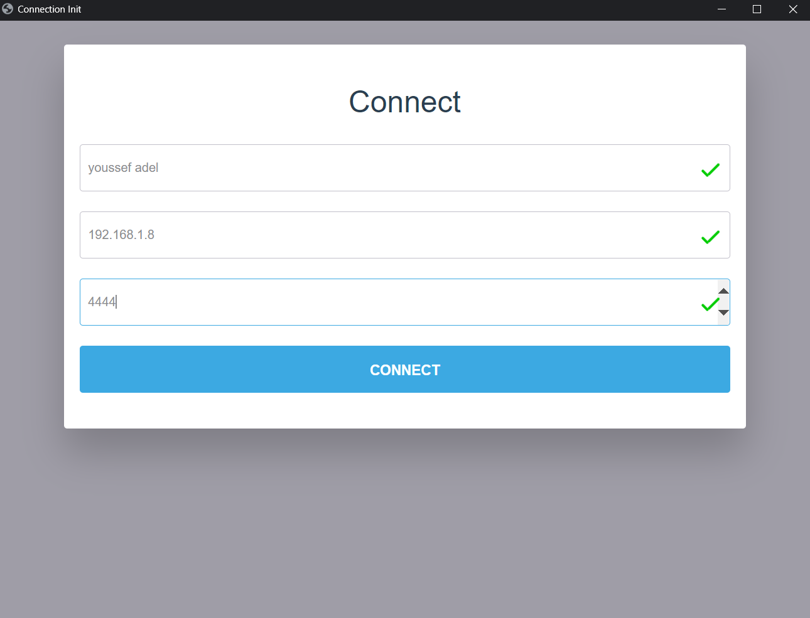
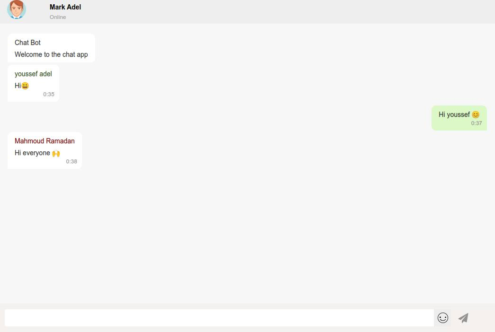

# Chat-App
Simple python chat app with eel 

### Start Server 
Run script at server directory 

Will start at port 4444

### Start Client
At app directory

Install all depences

```bash
pip insall -r requirements.txt
```
Run `app.py`


### Connect clients to server



### Enjoy


